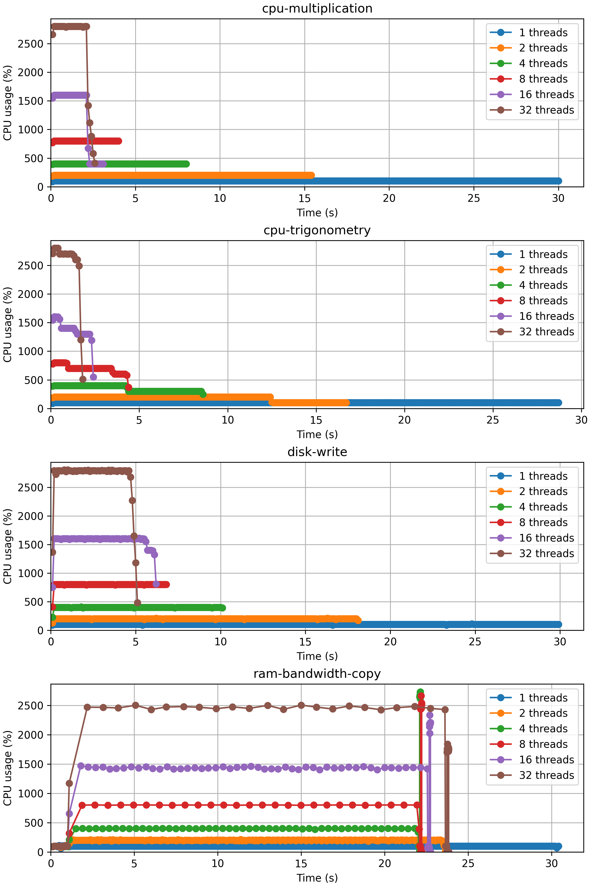

<!-- Copyright 2022 Vincent Jacques -->

*bottlenecks* is an attempt to demonstrate the different performance bottlenecks that can appear in computer programs.

It's currently limited to programs running only on a CPU.
GPUs may be added later.

Usage
=====

Read my report
--------------

The simplest way to "use" this repository is to read [the report generated on my machine](reports/jacquev6-sam/report.md), which I have annotated with a few observations and explanations.

Generate your own report
------------------------

Run `./make.sh` then have a look at the report in `build/report/report.md`.

If you want to store the report somewhere else: `./make.sh report_directory=reports/**some_name**`. (Do this if you want to add your machine's report to the repository; feel free to open a pull request. In that case, please include all files in that directory.)

For quicker iterative work on the scripts: `rm -rf build; ./make.sh quick=1`.

Definition of the programs being tested
=======================================

- `cpu-multiplication` does only floating-point multiplications, using very little memory (a few bytes per thread)
- `cpu-trigonometry` computes cosines and arc-cosines, also using very little memory
- `disk-write` writes 1000 large-ish files on the disk
- `ram-bandwidth-copy` copies a large-ish memory array to another one

Open questions
==============

- Why does `cpu-multiplication` follow Amdahl's law way better than `cpu-trigonometry`? I would have assumed both are purely compute-bound.
- Would using [`select`](https://linux.die.net/man/2/select)-based non-blocking I/O help saturate the disk's bandwidth with fewer threads in `disk-write`?

Excerpts from the report
========================

Just to make you want to read [the full report](reports/jacquev6-sam/report.md) :)

## Duration *vs.* parallelism

Probably the most intuitive metric, this graph shows the duration of each program according to the number of threads used to run it.
Durations are normalized to the single-thread duration.

The thin dashed lines are representations of [Amdahl's law](https://en.wikipedia.org/wiki/Amdahl%27s_law) for $p$ (the parallel portion) varying from 10% to 100%.

## CPU usage

