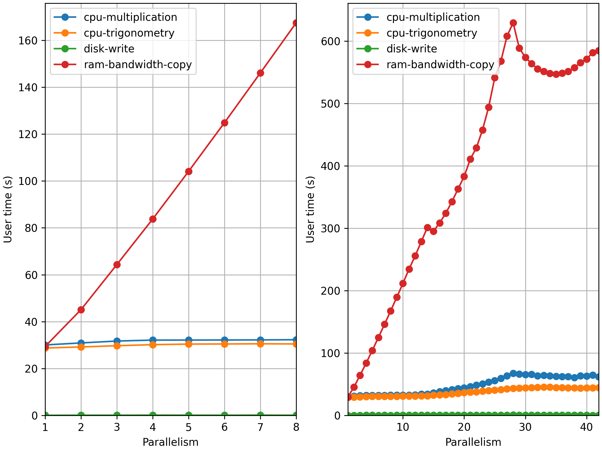
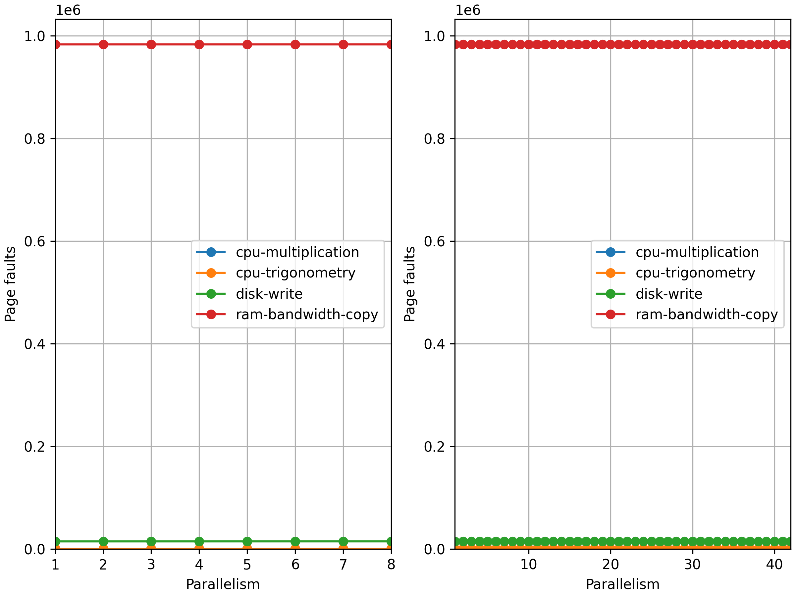
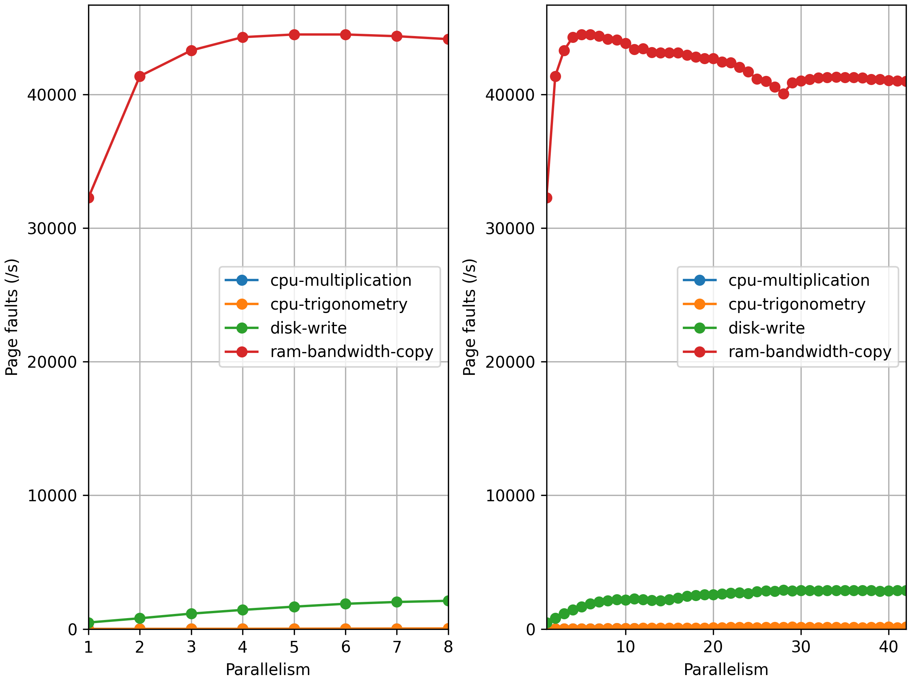
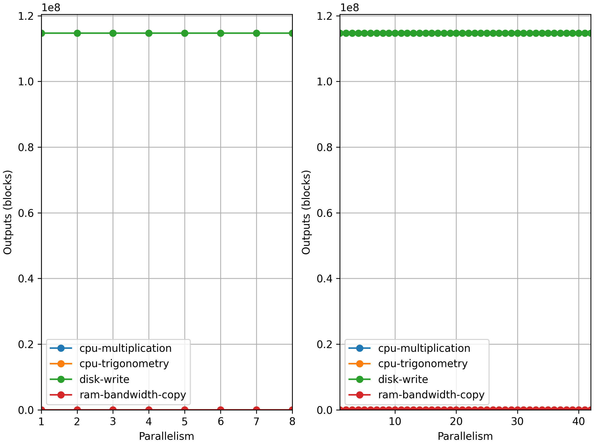
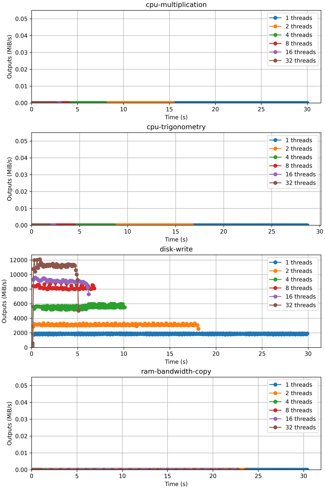

Whole-run metrics
=================

This section presents metrics about the whole run of each program, *e.g.* its duration, the total count of its I/Os, the total number of page faults, *etc.*

Duration *vs.* parallelism
--------------------------

Probably the most intuitive metric, this graph shows the duration of each program according to the number of threads used to run it.
Durations are normalized to the single-thread duration.

The thin dashed lines are representations of [Amdahl's law](https://en.wikipedia.org/wiki/Amdahl%27s_law) for $p$ (the parallel portion) varying from 10% to 100%.

The left-side graph is just a zoomed view of the other graph, for low parallelisms.

| Program  | Observation | Proposed explanation |
| --- | --- | --- |
| `cpu-multiplication` | follows Amdahl's law quite well (for parallelism no more than 15) | it's purely compute-bound and benefits from each additional compute resource |
| `cpu-multiplication` | has a performance loss for 15 threads | it suffers from hyper-threading overhead (the machine has 14 physical cores) |
| `cpu-multiplication` | has a performance loss for 29 threads | it suffers from  overhead (the machine has 28 hyper-threaded cores) |
| `cpu-trigonometry` | does *not* follow Amdhal's law so well for low parallelism | more on that in the "Instant CPU usage" section later, but try to figure it out before. Have a look at [the code](../../programs/cpu-trigonometry.cpp), *etc.* |
| `disk-write` | follows Amdahl's law quite well for low parallelism, then flattens out | it reaches the disk's bandwidth. I'm perplexed that it takes so many threads doing (blocking) writes to saturate this machine's SSD. Either I'm missing something, or the SSD is just pretty fast. |
| `ram-bandwidth-copy` | flattens quite fast | it reaches the RAM's bandwidth quite fast. I would have thought more threads would have been needed. Maybe this machine's RAM isn't so good? |

System and user times vs. parallelism
-------------------------------------

| Program  | Observation | Proposed explanation |
| --- | --- | --- |
| `disk-write` only | uses system time | it does I/Os |
| all others | don't use system time | they don't do I/Os |

| Program  | Observation | Proposed explanation |
| --- | --- | --- |
| `ram-bandwidth-copy` | uses user time proportional to parallelism (for low parallelism) | it's wasting CPU cycle in more and more cores, waiting for the RAM |
| all others | use a constant amount of user time (for low parallelism) | they do the same amount of computation regardless of parallelism |

Page faults vs. parallelism
---------------------------

| Program  | Observation | Proposed explanation |
| --- | --- | --- |
| all | have a constant number of page faults | parallelism does not impact the number of accesses to RAM |

Outputs vs. parallelism
-----------------------

| Program  | Observation | Proposed explanation |
| --- | --- | --- |
| all | have a constant number block outputs | parallelism does not impact the number of accesses to disk |

| Program  | Observation | Proposed explanation |
| --- | --- | --- |
| disk-write | reaches a plateau for more than 28 threads | I would really expect this to require fewer threads |

Context switches vs. parallelism
--------------------------------

| Program  | Observation | Proposed explanation |
| --- | --- | --- |
| all | have much more context switches for more than 28 threads | When all cores are busy, the scheduler *has* to switch contexts more often; it cannot let programs run freely forever |

Instant metrics
===============

This section presents metrics recording all along during the execution, like instant CPU usage or output rate.

CPU usage
---------

| Program  | Observation | Proposed explanation |
| --- | --- | --- |
| `cpu-multiplications` | CPU usage is a nice plateau corresponding to the number of threads | it's compute-bound and can use the all the compute resources it's given |
| `cpu-trigonometry` | CPU usage drops to fewer threads | This is why it doesn't follow Amdhal's law so well (see section "Duration vs. parallelism" above). The cause is a imbalance between threads: threads with higher `omp_thread_num` compute cosines of greater number than threads with lower `omp_thread_num`, because [`x = i * size + j`](../../programs/cpu-trigonometry.cpp:14), and it turns out computing cosines of large numbers is longer than for smaller numbers. |
| `cpu-multiplications` | CPU usage is a plateau corresponding to the number of threads | None; I need to understand why threads are not sleeping, waiting for blocking I/O to finish. |
| `raw-bandwidth-copy` | CPU usage is a plateau a bit below to the number of threads | Consistent with constant duration and increasing user time |

Memory usage
------------

Outputs
-------

